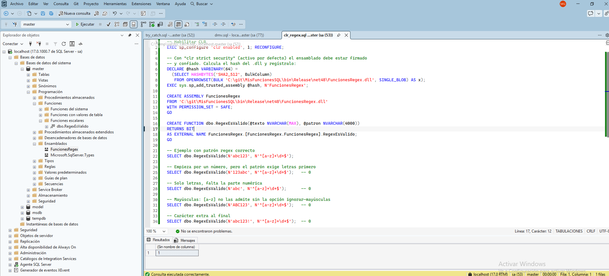

## Introducción

La integración del framework .NET dentro del propio motor de base de datos. Permite escribir procedimientos almacenados, desencadenadores (triggers) y funciones utilizando lenguajes como C# o VB.NET, ideal para operaciones matemáticas complejas, manipulación de cadenas o acceso a recursos externos donde T-SQL es ineficiente.

## Ejemplo

Ver la implementación dll en git: `C:\git\MisFuncionesSQL` y la sql `clr_regex.sql` para desplegarlo. Resultado y tests desde SQL Server Management Studio.

