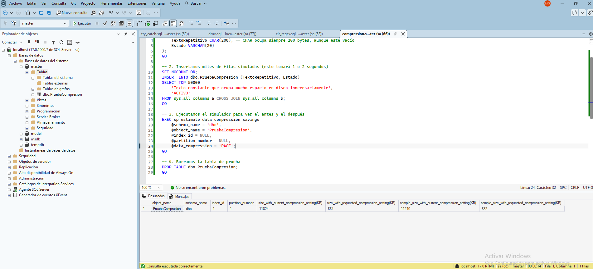

## Introducción

Funcionalidad de compresión de datos a nivel de fila y de página. Permite reducir drásticamente el espacio de almacenamiento en disco y, lo que es más importante, reduce las operaciones de entrada/salida (E/S) al leer más datos en la misma cantidad de memoria RAM, a cambio de un ligero aumento en el uso de CPU.

## Ejemplos:
Ver un ejemplo simulado en y `compression.sql` desde SQL Server Management Studio. Con estos resultados:

- object_name: El nombre de la tabla evaluada, indicando que es "PruebaCompresion". 
- schema_name: El esquema al que pertenece la tabla dentro de la base de datos, en este caso "dbo". 
- index_id: El identificador del índice físico evaluado. El valor 1 significa que se está evaluando el índice agrupado (Clustered Index), es decir, la estructura principal donde residen los datos de la tabla ordenados por su clave primaria. (El valor 0 indicaría una tabla sin índice, conocida como Heap). 
- partition_number: El número de partición de la tabla. Como la tabla no está dividida en múltiples particiones de almacenamiento, todo reside en la partición predeterminada 1. 
- size_with_current_compression_setting(KB): El tamaño total que la tabla ocupa físicamente en el disco en este momento con su configuración original (sin compresión), alcanzando los 11824 KB. 
- size_with_requested_compression_setting(KB): La estimación del tamaño final de la tabla si aplicas la compresión, proyectando una caída drástica a solo 664 KB. Esto demuestra gráficamente la reducción de las operaciones de Entrada/Salida (E/S) mencionada en la teoría. 
- sample_size_with_current_compression_setting(KB): El tamaño de la muestra de datos reales (11240 KB) que el motor de SQL Server copió temporalmente para realizar la prueba matemática. Para no saturar la CPU en tablas de terabytes, el procedimiento toma una muestra representativa en lugar de evaluar cada registro. 
- sample_size_with_requested_compression_setting(KB): El tamaño resultante de esa muestra específica tras aplicarle el algoritmo de compresión en memoria durante la prueba, reduciéndose a 632 KB. SQL Server utiliza la diferencia entre estas dos últimas columnas de muestra para calcular la proyección total

