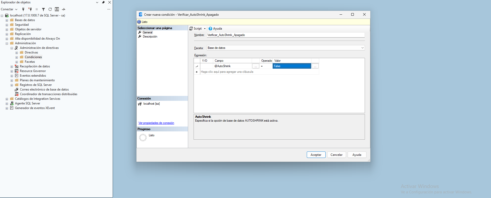

## Introducción

Un sistema que permite a los DBAs definir, aplicar y monitorizar reglas de configuración en una o varias instancias de SQL Server. Por ejemplo, se puede forzar una directiva que exija que todas las tablas tengan una clave primaria o que la opción "Auto-Shrink" esté siempre desactivada.

## Ejemplos

Como evitar activar Auto-Shrink a la hora de crear o actualizar un tabla. Creamos primero la condición: Verificar_AutoShrink_Apagado.

Después  creamos la política Forzar_AutoShrink_Apagado y asociamos esa condición la aplicamos a toda la base de datos, añadimos como modo de evaluación On change: prevent, que creará un trigger DDL de servidor a nivel base de datos que previene que actimos este modo para cada una de las tablas que vayamos a crear o intentemos actualizar con este argumento autoShrink, disparando un error en caso de que queramos activarlo incumpliendo la policy recién creada.

Como no existe un PBM para poder chequera si una tabla se crea o no con cable primaria, deberemos de utilizar un DDL Trigger a nivel de database sobre la creación de una tabla de este tipo:

Ver un ejemplo simulado en y `pbm.sql` desde SQL Server Management Studio. Con estos resultados:

