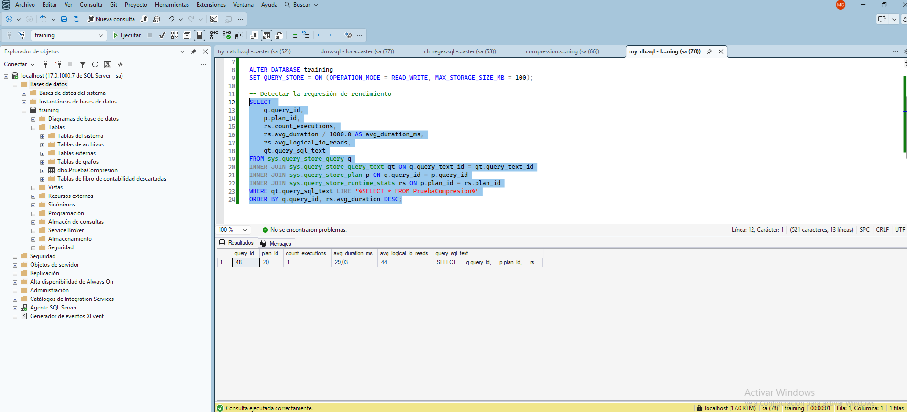

## Introducción

Query Store (Almacén de consultas): Actúa como una "caja negra" o registrador de vuelo para el motor relacional. Captura automáticamente un historial de consultas, sus planes de ejecución y sus estadísticas de rendimiento (CPU, lecturas, duración) a lo largo del tiempo. Es la herramienta definitiva para detectar regresiones de rendimiento y permite a los DBAs forzar un plan de ejecución óptimo con un solo clic.

Ver un ejemplo simulado en y `query_store.sql` desde SQL Server Management Studio. Con estos resultados:

