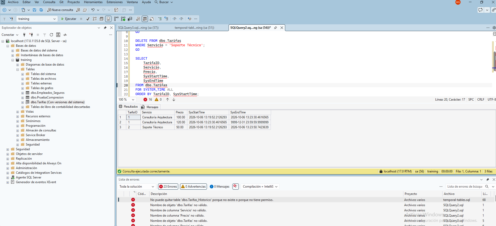

## Inntroducción
Temporal Tables (Tablas temporales con control de versiones): Tablas que mantienen automáticamente un historial completo de los cambios de datos. El sistema gestiona de forma transparente una tabla histórica adjunta y columnas de periodo (ValidFrom, ValidTo). Permite realizar consultas "viajando en el tiempo" usando la cláusula `FOR SYSTEM_TIME AS OF <fecha_hora>`, ideal para auditorías y recuperación de borrados accidentales.

Ver un ejemplo simulado en y `temporal-tables.sql` desde SQL Server Management Studio. Con estos resultados:

