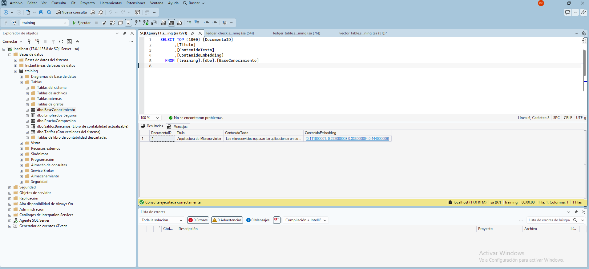

## Introducción

Ledger integra conceptos criptográficos de blockchain directamente en el motor relacional. Crea tablas a prueba de manipulaciones (tamper-evident) mediante la generación de hashes de transacciones. Es ideal para auditorías y cumplimiento normativo, ya que garantiza de forma matemática que nadie (ni siquiera un DBA con privilegios máximos) ha alterado el historial de los datos.

Ver un ejemplo simulado en `ledger_table.sql` y chequeo del mismo en `ledger_check.sql` desde SQL Server Management Studio. Con estos resultados:

