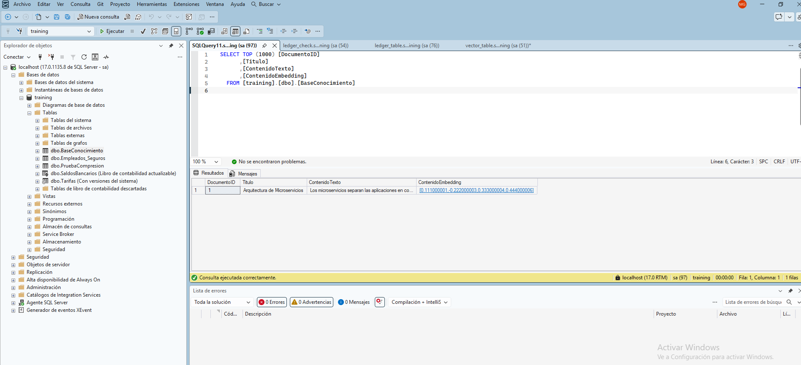

## Introducción

Tipo vector y funciones de IA: Transforma el motor transaccional en una base de datos vectorial. Introduce el tipo de dato nativo VECTOR para almacenar embeddings y funciones integradas para el cálculo de distancias (como la similitud del coseno). Esto permite ejecutar búsquedas semánticas e implementar arquitecturas RAG (Retrieval-Augmented Generation) directamente donde residen los datos, sin depender de bases de datos vectoriales externas.

Ver un ejemplo simulado en `vector_table.sql` desde SQL Server Management Studio. Con estos resultados:

